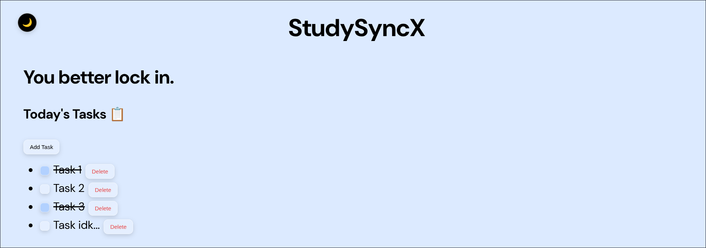

# StudySyncX

Forgetting ur tasks? Try out StudySyncX to manage them.

## Description

StudySyncX is a student productivity app where you can add tasks, mark them completed, and delete them once done. Tasks are saved using LocalStorage, so you can close and open it whenever you want to. (Just a beginner project to learn JS)

### Screenshots

[Try it out](https://tejaswa10.github.io/studysyncx/)

## Tech Stack

* HTML - Used to create the structure of the website.
* CSS - Used to style the website and add animations.
* JavaScript - Used to add tasks, manage checkboxes, delete tasks, and save tasks using LocalStorage.
* Git & GitHub - Used to track changes and store the project.

## Getting Started

### Dependencies

* A web browser like Chrome, Firefox, or Edge
* Internet connection for the Google Font used

## Credits

* Font: DM Sans from Google Fonts
